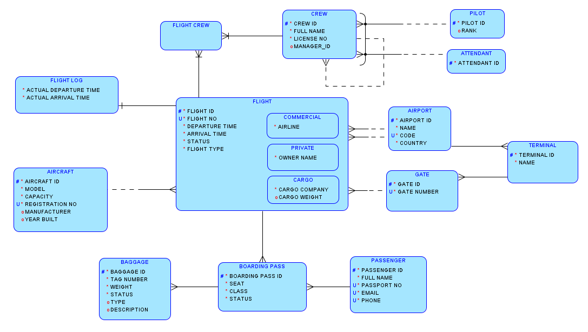

# Airport Flight Management Database

This project focuses on conceptual and logical database design with full relational mapping. Triggers and constraints enforce realistic aviation business logic. Can be extended with API layers or admin dashboards for operational use.

## Contents
- [Project Description](#project-description)
- [Business Rules and Assumptions](#business-rules-and-assumptions)
- [Entity-Relationship Diagram (ERD)](#entity-relationship-diagram-erd)
- [Relationship Types](#-relationship-types)
- [Table Mapping](#table-mapping)
- [Implementation](#implementation)
- [Example Data](#example-data)
- [Getting Started](#getting-started)

## Project Description
The primary goal of this project is to design a **relational database model** for tracking data related to:

- Flights  
- Aircraft and airport infrastructure  
- Flight crew  
- Boarding passes  
- Passengers  
- Baggage  

This database system provides a structured foundation for managing operations within an airport environment — ensuring data integrity, efficient flight scheduling, and clear relationships between entities like aircraft, passengers, and staff.

---

## Business Rules and Assumptions

1. Each **Flight** is categorized as **Cargo**, **Commercial**, or **Private**, and is linked to **exactly one Aircraft**.  
2. A **Boarding Pass** can only be issued for **Commercial** or **Private** flights (not Cargo).  
   - **Baggage** is always linked to a **Boarding Pass**.  
3. A **Flight** may have multiple **Crew Members**, and crew can serve on multiple flights.  
   - A crew member can be a **Pilot** or **Attendant**.  
   - Crew members may optionally **report to a supervisor** (recursive relationship).  
4. Every **Passenger** must have a **unique passport number** and **contact info** (email and phone).  
   - A passenger can have **multiple boarding passes**.  
5. Each **Flight** departs from and arrives at **two different airports**, and both **scheduled** and **actual** times are recorded.  
6. **Gate numbers** are unique within a terminal, and every **Gate** belongs to a **specific Terminal**.

---

## Entity-Relationship Diagram (ERD)

The full ERD illustrating entity relationships and cardinalities is provided below:



---

## Relationship Types

| Relationship | Description |
|---------------|--------------|
| **Aircraft – Flight** | One Aircraft → Many Flights (1:N) |
| **Gate – Flight** | One Gate → Many Flights (1:N over time) |
| **Airport – Terminal – Gate** | Hierarchical structure (1:N:N) |
| **Flight – Departure/Arrival Airports** | Each Flight departs and arrives at a single Airport (N:1) |
| **Flight – Crew (via FlightCrew)** | Many-to-Many (M:N) resolved by intersection entity |
| **Crew (Manager ID)** | Recursive 1:N (supervisor relationship) |
| **Crew – Pilot/Attendant** | 1:N XOR relationship (via Arc) |
| **Passenger – Boarding Pass** | One Passenger → Many Boarding Passes (1:N) |
| **Boarding Pass – Baggage** | One Boarding Pass → Many Baggage (1:N) |
| **Boarding Pass – Flight (Constraint)** | Only for Commercial or Private flights (enforced via trigger) |
| **Flight – Flight Log** | One-to-One (1:1) relationship |

---

## Table Mapping

Full table-to-entity mappings:

  


---

## Implementation

The SQL schema defining all tables, relationships, constraints, triggers, and indexes can be found here:

[**airport-flight-management-system.sql**](./airport-flight-management-system.sql)

This script includes:

- Table creation with primary and foreign keys  
- Relationship constraints (1:N, M:N, 1:1)  
- Triggers to enforce business rules (e.g., boarding pass flight type restriction)  
- Data integrity rules (unique keys, not nulls, etc.)

---

## Example Data

Sample data for testing and demonstration purposes can be found here:

[**insert.sql**](./insert.sql)

This file contains:
- Example aircraft, crew, passengers, and airports  
- Flight schedules  
- Sample boarding passes and baggage records  

---

## Getting Started

To get started with this project locally:

1. Clone the repository:
   ```bash
   git clone https://github.com/vesc0/airport-flight-management-db.git
   cd airport-flight-management-db
   ```
2. Open your SQL environment (e.g., MySQL Workbench, PostgreSQL, or SQLite).
3. Execute the schema script:
   ```bash
   SOURCE airport-flight-management-system.sql;
   ```
4. (Optional) Load example data:
   ```bash
   SOURCE insert.sql;
   ```
5. Explore and query the database!
